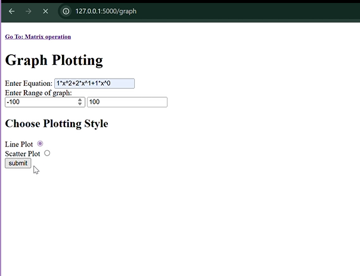
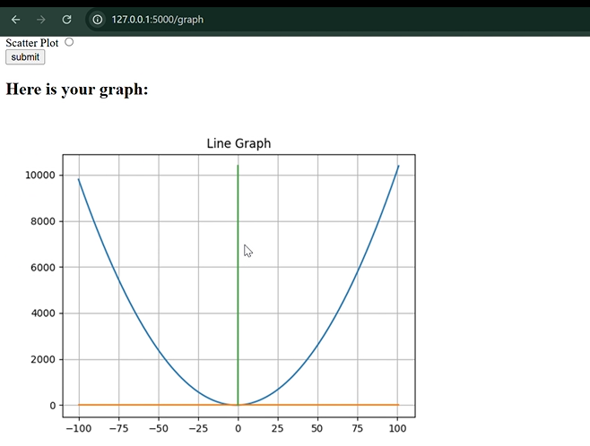
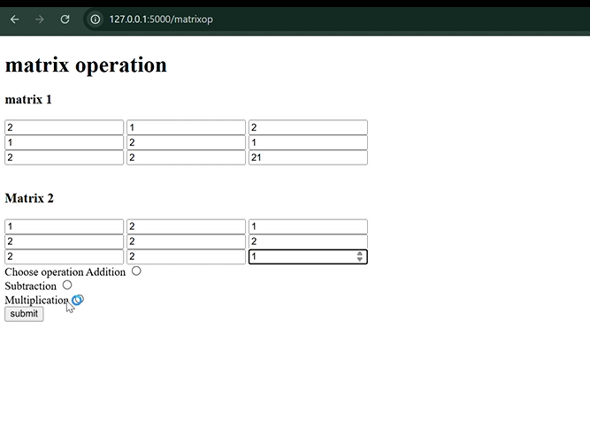
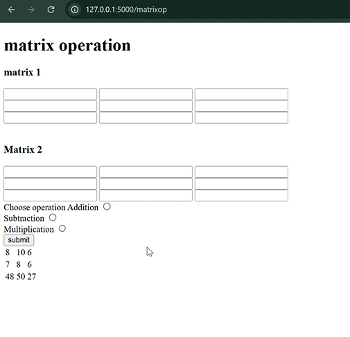

# Graphing Calculator Web App

A Flask-based web application to plot mathematical equations and perform basic matrix operations.

## 🔧 Features
- Plot equations (line, parabola, etc.) based on user input and range
- Matrix operations (3×3): addition, subtraction, multiplication
- Multi-route design for clean navigation
- Uses Matplotlib for plotting graphs

## 🖼️ Screenshots





## 💻 Tech Stack
- Python
- Flask
- Matplotlib
- HTML (Jinja2 Templates)

## 🚀 Run the App
```bash
python app.py
